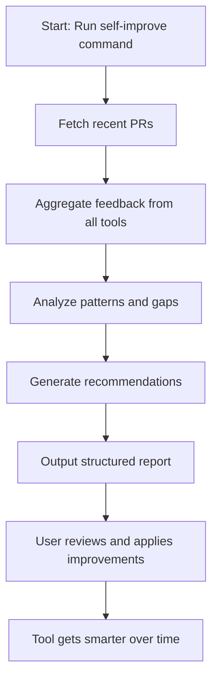
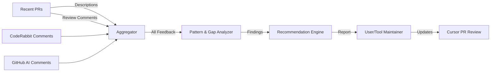

# Self-Improvement Process in Cursor PR Review

## Overview

The self-improvement feature is a meta-analysis system that helps Cursor PR Review become a smarter, more effective code reviewer over time. It does this by learning from its own history—analyzing past pull requests (PRs), review comments, and feedback from both internal and external tools.

This document explains how the self-improvement process works, the logic behind it, what it produces, and how you can use its output to improve the tool. It is written for both beginners and experienced programmers.

---

## 1. What is Self-Improvement?

Self-improvement is an automated process that:
- Looks at many recent PRs in your repository (not just one)
- Aggregates feedback from multiple sources (Cursor PR Review, CodeRabbit, GitHub AI, etc.)
- Identifies patterns, gaps, and recurring issues in code reviews
- Generates actionable recommendations for improving the review tool itself (prompts, detection logic, etc.)

---

## 2. How Does It Work?

### Step-by-Step Logic

1. **Fetch Recent PRs:**
   - The tool retrieves a set of recent PRs from your repository (e.g., the last 5-10).

2. **Aggregate Feedback:**
   - For each PR, it collects:
     - The PR description/body
     - Review comments from Cursor PR Review
     - Comments from CodeRabbit and GitHub AI (if available)

3. **Pattern Analysis:**
   - It analyzes all collected comments to find:
     - Common issue types (e.g., security, error handling, performance)
     - Recurring strengths and weaknesses
     - Gaps (issues found by one tool but missed by others)

4. **Generate Recommendations:**
   - Based on the analysis, it creates a list of actionable recommendations, such as:
     - Update prompt templates to better detect certain issues
     - Improve detection logic for missed vulnerabilities
     - De-duplicate findings between tools
     - Add new checks for recurring problems

5. **Output Report:**
   - The tool outputs a structured report summarizing:
     - Patterns and trends
     - Gaps and blind spots
     - Concrete steps to improve the tool

---

## 3. What Does the Output Look Like?

The self-improvement report typically includes:

- **Summary of Patterns:**
  - E.g., "CodeRabbit frequently finds security issues missed by our tool."
- **Gap Analysis:**
  - E.g., "Our tool missed 2 SQL injection vulnerabilities flagged by CodeRabbit."
- **Recommendations:**
  - E.g., "Enhance prompt to explicitly ask for SQL injection checks."
- **Actionable Steps:**
  - E.g., "Update the default prompt template to include OWASP Top 10."
- **Attribution:**
  - Shows which tool found which issues.

The output is designed to be clear for both beginners (with explanations) and experts (with specifics and references).

---

## 4. How is the Output Used to Improve the Tool?

- **Prompt Updates:**
  - Use recommendations to update or create new prompt templates, making the AI reviewer more effective.
- **Detection Logic:**
  - Add or refine code checks based on missed issues or recurring patterns.
- **Configuration Tuning:**
  - Adjust settings (e.g., review strictness) to better match your team's needs.
- **Documentation:**
  - Document new best practices or lessons learned for future contributors.

**Example Workflow:**
1. Run the self-improvement command:
   ```bash
   python cursor_pr_review.py self-improve
   ```
2. Review the generated report in your terminal or logs.
3. Apply the recommended changes to prompts, logic, or config.
4. Optionally, re-run the analysis after making changes to measure improvement.

---

## 5. Why is This Important?

- **Continuous Learning:** The tool gets smarter over time, just like a good human reviewer.
- **Data-Driven:** Improvements are based on real feedback, not guesswork.
- **Closes Gaps:** Helps ensure your tool doesn't miss issues that other tools catch.
- **Builds Trust:** Shows users and contributors that the tool is actively learning and improving.

---

## 6. Who Should Use This?

- **Tool Maintainers:** To keep the reviewer up-to-date and effective.
- **Teams:** To ensure code review quality improves as your codebase grows.
- **Contributors:** To understand how the tool evolves and how they can help.

---

## 7. Summary Table

| Step                | What Happens                                      |
|---------------------|---------------------------------------------------|
| Fetch PRs           | Gets recent PRs and their review comments         |
| Aggregate Feedback  | Collects comments from all tools                  |
| Pattern Analysis    | Finds trends, gaps, and recurring issues          |
| Recommendations     | Suggests prompt, logic, and config improvements   |
| Output Report       | Summarizes findings and next steps                |
| Apply Improvements  | Update tool based on report                       |

---

## 8. Process Flow Diagram



---

## 9. Data Flow Diagram



---

## 10. Frequently Asked Questions (FAQ)

### Q1: What is the main goal of self-improvement?
**A:** To help Cursor PR Review learn from its own history and become a more effective, reliable code reviewer by analyzing past PRs and feedback from multiple sources.

### Q2: How often should I run the self-improvement process?
**A:** It's recommended to run it periodically (e.g., after every few sprints or major releases), or whenever you notice recurring issues or want to tune the tool's performance.

### Q3: Does self-improvement change my code or config automatically?
**A:** No. It generates a report with recommendations. You (the tool maintainer) decide which changes to apply.

### Q4: Can I use self-improvement on any repo?
**A:** Yes, as long as the repo has a history of PRs and reviews. The more data, the more valuable the analysis.

### Q5: What if I only have a few PRs?
**A:** The process still works, but the insights will be limited. As your repo grows, the analysis becomes more powerful.

### Q6: Will this slow down my regular PR reviews?
**A:** No. Self-improvement is a separate, on-demand process. Regular PR reviews remain fast and focused on individual PRs.

### Q7: Can I customize what the self-improvement process looks for?
**A:** Yes! You can update prompt templates, detection logic, and even add new analysis modules as your needs evolve.

### Q8: How do I know if the tool is actually improving?
**A:** By comparing self-improvement reports over time, you can see if recurring issues decrease and if the tool's recommendations become more aligned with your team's needs.

---

**In short:**
The self-improvement process is how Cursor PR Review learns from its own history to become a better, more reliable code reviewer for your team. 